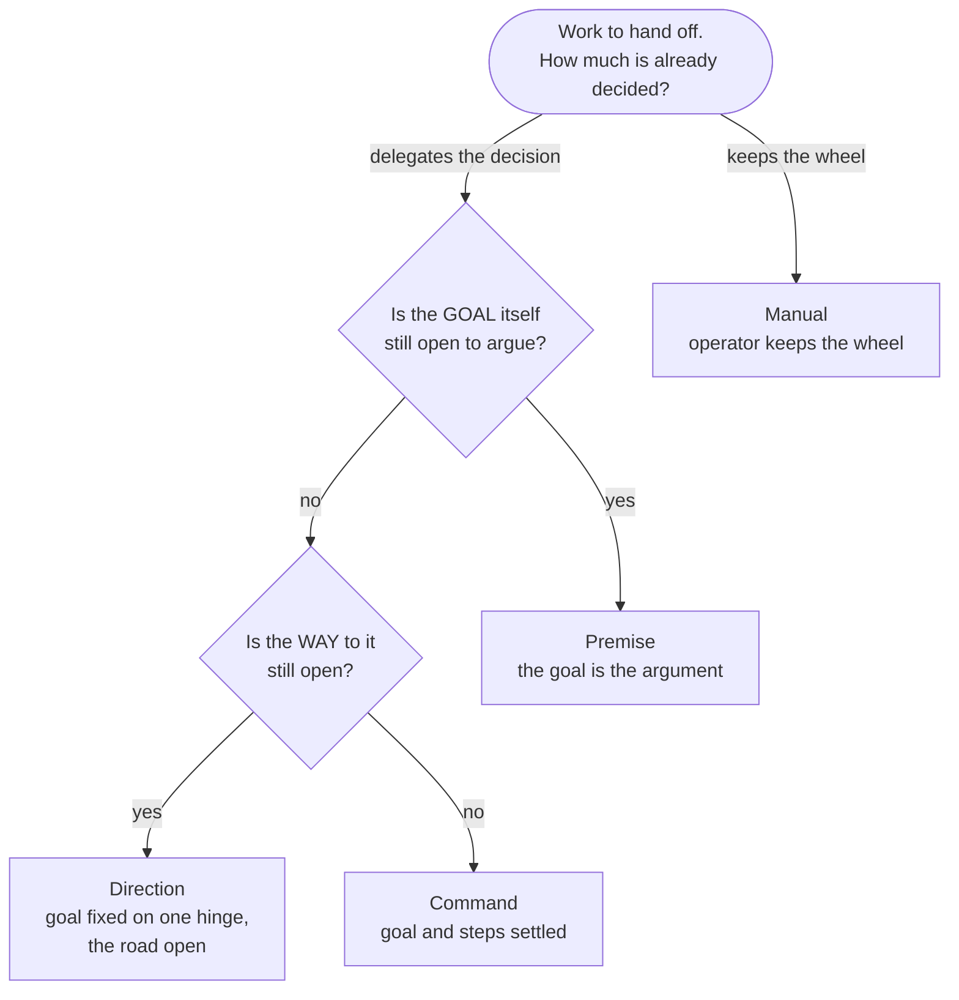

# Vaudeville quick-start guide

This manual takes you from "decided to evaluate" to installed, configured, and running daily work — and you can start playing without the whole rulebook. The rulebook exists (the [doctrine](.), primed into every agent), but its complete readers are the agents; what *you* need is this page's orientation, the setup chapters, and the moves at the junctions where your judgment is wanted. Term first-uses link to [vocabulary.md](vocabulary.md); exhaustive reference lives elsewhere.

This manual has two readers, on purpose. The second is an agent standing up a tenant on its operator's behalf — if that is you, one standing check before anything else: the tenant you are configuring is *not* the Vaudeville project itself, so none of the framework's own self-hosting arrangements (its integrator, its repository roster, its component names) belong in your tenant's configuration. When a step below tempts you to copy one of them, that is the pattern-match to refuse.

## Orientation: enough to play

The working unit is a [Bob](vocabulary.md#bob): a fresh agent session spawned into its own git worktree, handed one [Assignment](vocabulary.md#assignment), run until the work is delivered, then gone. It remembers nothing it was not given: it forks from a [Foundation](vocabulary.md#foundation) (a session primed with the doctrine, your project's conventions, and the repository's own spec) and reads a [Brief](vocabulary.md#brief) (the one thing it is for). Your job is not to supervise it line by line; your job is **adjudication of meaning** — you appear at the junctions where a decision crystallizes, and the machinery handles everything between them.

An Assignment comes in four kinds, told apart by how much you have already decided. Take one piece of work — an audit log — and turn it through two questions:

| Kind | Is the goal still open? | Is the way still open? | The audit log as… | Routes it may take |
| --- | --- | --- | --- | --- |
| [Premise](vocabulary.md#premise) | Yes | — | *"Is event-sourcing even the right model?"* | check-in · plan · explore |
| [Direction](vocabulary.md#direction) | No — settled on one named hinge | Yes | *"Move it to event-sourcing; work out how."* | check-in |
| [Command](vocabulary.md#command) | No | No | *"Run the migration in these steps."* | check-in · direct |
| [Manual](vocabulary.md#manual) | Neither question delegated — you keep the wheel | | *"Investigate; change nothing until I say."* | none |



The diagram is the decision you make each time you file work. One rule carries most of the discipline: a Premise never contains acceptance criteria — a model treats any AC-shaped list as the contract and stops pressing the framing, which is the one thing a Premise exists to have pressed. That's the orientation. The rest of the vocabulary arrives as you meet it.

Still evaluating rather than installing? The no-install win is the prompt-regression technique in [recipes/tuning-a-prompt.md](recipes/tuning-a-prompt.md) — it works against any standing agent prompt you already maintain. The chapters below stand up the full framework.

## Prerequisites

Have all of the following on the host before you start. The installer checks only some of them, so verify the rest yourself:

- **`uv`** on `PATH` — the installer runs via `uvx` and pins Python 3.14.
- **`workmux`** on `PATH` (from [github.com/raine/workmux](https://github.com/raine/workmux)) — it drives `tmux`, so **`tmux`** must be installed too.
- **`gh`** (or `curl` + `tar`) — to download the release.
- **`git`**.
- A reachable **YouTrack** instance — API base `https://<instance>.youtrack.cloud/api` and a permanent token (`perm-...`) minted on an account that can create projects and edit their schema.
- **Claude Code** (`claude`) on `PATH` **and authenticated**, installed per Anthropic's own documentation.

**Caution:** the installer verifies only that the `claude` binary is *present*, and only at priming time — never that it is authenticated. An unauthenticated `claude` passes every up-front gate and then fails partway through priming. Authenticate `claude` before installing.

## Provision the tracker

Vaudeville keeps its lifecycle state in a YouTrack project — one per [Component](vocabulary.md#component) — and that project needs a specific schema before the tool can file or move work: the custom fields Vaudeville reads (**Type**, **Route**, **State**, **Workflow**, **Signed off**), a **Depend** link type for the dependency graph, the state and workflow bundles behind those fields, and a set of essential defaults (Type=Premise, Route=check-in, State=Submitted, Workflow=Submitted, Signed off=No).

Once the tool is installed, it builds this schema for you: `vaudeville enroll` provisions a Component's tracker as it stands the Component up (see [Standing up a Component](#standing-up-a-component)). Your *first* Component, though, is provisioned before that tool exists — this section runs ahead of **Install** — so stand its tracker up by hand: create the project, add the fields and the link type, wire the state/workflow bundles, and set the essential defaults. On a YouTrack instance that already runs a Vaudeville project, replicate that project's fields, bundles, and defaults onto the new one; the first project on a fresh instance has no exemplar and must be configured field by field.

The authoritative field list, states, and link types live in the provisioning primitive `enroll` calls, not in this manual — so a first Component built by hand has no written schema to copy against; prove it by filing and moving one real Assignment end to end before you trust it.

Once the project exists, read its **`yt_id`** (YouTrack's internal project id, e.g. `0-5`) off the project's settings page — you will need it for the config below, and no command reports it.

## Write the config

The config directory defaults to `~/vaudeville-config`. Start from the template at `github.com/somehowsoftware/vaudeville-config-template`. It holds two files.

**`vaudeville.toml`** — one `[projects.<PREFIX>]` table per Component, keyed by tracker prefix, plus one top-level spawn table. A tenant's own Components go here (the example is a web front end, not anything of Vaudeville's own):

```toml
[projects.WEB]
yt_id       = "0-5"                                    # required: YouTrack internal project id
repo_path   = "~/repos/storefront-web"                 # required: clone path on host (~ expands)
name        = "Storefront Web"                          # required: operator-facing long name
short_name  = "web"                                     # optional
description = "The customer-facing storefront"           # optional, strongly recommended: routes work to the right repo
remote      = "git@github.com:acme/storefront-web.git"  # optional: enables current readings at canonical tip

[spawn.downstream]
command = ["vv", "assignment-context"]
```

**Caution (template drift):** the template ships `command = ["vv", "premise-context"]`. That verb no longer exists; leave it and spawns break. Set it to `["vv", "assignment-context"]`. The template's comments also say `description` is required and omit `name` — that is backwards: **`name` is required, `description` is optional.**

**`credentials.toml`**:

```toml
[youtrack]
api_base = "https://<instance>.youtrack.cloud/api"
api_key  = "perm-..."
```

Environment variables `YOUTRACK_API_BASE` and `YOUTRACK_API_KEY` override this file.

## Install

Vaudeville reaches you as one versioned release — the whole tool, compiled into a single artifact and published at `somehowsoftware/vaudeville`. That release *is* the product: you install it, and you never clone, build, or reference the framework's own source repositories. Download it, unpack it, and enter the artifact root:

```
gh release download --repo somehowsoftware/vaudeville --pattern '*.tar.gz'
tar xzf vaudeville-*.tar.gz
cd vaudeville-*/
```

From the artifact root, run the installer:

```
uvx --python 3.14 --from cli/vaudeville_install-*.whl vaudeville-install \
  --artifact . \
  --destination host \
  --config-dir ~/vaudeville-config
```

Tenants always use `--destination host`. (The other value, `staging`, exists only for the framework's own development and is nothing a tenant sets.)

The installer rebuilds only what it owns — the doctrine and skills, the hooks, the tenant's project-docs, the `vv` and `vaudeville` binaries, and two managed keys in `settings.json` — and never touches operator-curated state, so an existing authenticated Claude Code configuration survives the install.

## Verify

The installer lays down the scaffold (`~/.claude`, `~/.vaudeville`, `~/.local/bin`) and then runs four gates itself, aborting with a named error on any failure — so a clean install has already passed all of them:

1. **Surface Check** — the agent CLI answers.
2. **Host-wiring Check** — YouTrack is reachable and `workmux --version` runs.
3. **Priming** — [Foundations](vocabulary.md#foundation) build across every Component.
4. **Foundation check** — every Foundation verifies as durable.

**Caution:** the Host-wiring Check passes on *any* HTTP response, including `401`. A bad token clears wiring at install time and fails later, during real tracker calls. Confirm the token is valid the one way that exercises it — file or list actual work.

Both `vv` and `vaudeville` now resolve from `~/.local/bin`; make sure that directory is on your `PATH`. You will only ever type `vaudeville` yourself (see below), but the agents drive `vv`, so both must be reachable.

## First work

Your entire shell surface is one command, `vaudeville`, with seven verbs — `bob`, `enroll`, `pickable`, `prime`, `refresh`, `spawn`, and `update`. Everything else you do happens inside an agent conversation, through skills you invoke with `/`. You never type `vv`: that is the agents' own 34-verb facade, [Component](vocabulary.md#component)-scoped, driven by the skills and the machinery on your behalf. Run the loop end to end once:

1. **Open a working conversation.**

   ```
   vaudeville bob <Component>
   ```

   This forks an Assignment-less, primed session in the Component — an agent already holding the doctrine and your project's conventions, ready to talk. This is where you file and steer.

2. **File an [Assignment](vocabulary.md#assignment).** In that conversation, invoke the skill for the kind: `/premise` (ends open), `/direction` (ends settled on one hinge), `/command` (both settled), or `/manual` (you keep the wheel).

3. **Sign off if needed.** In the conversation, `/sign-off`. For a [Command](vocabulary.md#command) or [Manual](vocabulary.md#manual), sign-off is the gate that admits it to the pickup pool. For a [Premise](vocabulary.md#premise) or [Direction](vocabulary.md#direction) (already pickable), it records your endorsement of the framing, which the picking [Bob](vocabulary.md#bob) reads on its first turn.

4. **Spawn a Bob.**

   ```
   vaudeville spawn <ASSIGNMENT>
   ```

   This cuts a worktree and seeds a fresh Bob, which claims the Assignment on its first turn and works it. (Inside a conversation, the `/spawn` skill does the same.)

5. **Receive the tender.** The working Bob carries its finished work to a pull request through the `/tender` skill — local CI, push, PR, a bounded watch on that PR's CI — and reports the PR with its CI verdict to you. Changes you ask for land as new commits on the same PR.

6. **Merge.** Merging is yours: review the PR and merge when satisfied. Agents never merge to main. (A [Track](vocabulary.md#track) member's PR targets the Track's branch instead, and the Track's integration into main is its own deliberate, check-in-triggered event.)

7. **Close.** Inside the Bob, `/closeout <disposition>` — one of `delivered`, `abandoned`, `returned`, `unclaim`, or `none` — or `/onward`, which is `delivered` plus spawning a Bob on every downstream Assignment this close newly unblocked.

## Standing up a Component

Once installed, wiring an existing repository into your tenant as a [Component](vocabulary.md#component) is one verb:

```
vaudeville enroll <PREFIX> --repo-path <path> --config-dir <config repo checkout> --name "<long name>" --kind context|resource
```

It provisions the Component's tracker, registers it in your config repo's `vaudeville.toml`, and scaffolds its documentary skeleton — into a repository you already built. It never creates that repository, or its CI, branch protection, or review rules: those are the tenant's, outside anything Vaudeville touches. A [Context](vocabulary.md#context), which adjudicates a domain of its own, is scaffolded with a stub `docs/spec.md` and `docs/vocabulary.md`; a [Resource](vocabulary.md#resource), which holds no domain, gets neither. That spec and vocabulary — primed into a [Foundation](vocabulary.md#foundation), and pointedly not a `CLAUDE.md` — are how a Vaudeville Component carries the meaning its Bobs work from, and the scaffold lays that shape down where the first Bob will look for it.

`enroll` does not build the Foundation. A Bob sources its Component from the published remote, so a skeleton you have not pushed is invisible to it: commit and push both, the scaffold in the enrolled repo and the registration in your config repo. Then `vaudeville refresh` copies your config repo's `vaudeville.toml` over `~/.vaudeville/vaudeville.toml` and builds the new Component's Foundation.

## Daily operation

| Need | How |
| --- | --- |
| Open a working conversation in a Component | `vaudeville bob <Component>` |
| See what's ready to pick up across all Components | `vaudeville pickable` |
| Spawn a Bob on an Assignment | `vaudeville spawn <ASSIGNMENT>` |
| Stand up a new Component from an existing repo | `vaudeville enroll <PREFIX> …` — see [Standing up a Component](#standing-up-a-component) |
| Carry an edit to your config repo onto this host | `vaudeville refresh` — it rebuilds Foundations too, when the register or your project docs moved |
| Rebuild a Foundation after a Component's own spec or vocabulary moved | `vaudeville prime <Component>` (or `--all` for every Component) |
| Take the newest framework Release, doctrine included | `vaudeville update` |
| File · sign off · tender · close | in a conversation: `/premise`·`/direction`·`/command`·`/manual` · `/sign-off` · `/tender` · `/closeout`·`/onward` |

That table is the whole of your shell: seven `vaudeville` verbs, and the rest done by talking to agents. If you find yourself reaching for `vv` at a prompt, you have stepped onto the agents' surface, not yours.

Two moves live inside a Bob's own conversation rather than at your shell, invoked as skills when a session outgrows or completes its work:

- `/checkpoint` — shed an oversized conversation in place and resume the same work in a fresh one.
- `/closeout` — archive the worktree and end the Bob once its Assignment resolves.

`vaudeville prime` rebuilds a Component's [Foundation](vocabulary.md#foundation) so that every Bob forked afterward carries the change; reach for it when a Component's own spec or vocabulary moved. An edit to your config repo is `refresh`'s to carry, not `prime`'s: `prime` reads the map this host already holds, so a Component registered only in your config repo is one `prime` cannot see. Doctrine travels with the framework itself, and `vaudeville update` is what brings it.

## A day in the operator's chair

Running work does not look like "write prompts and review diffs." At any moment a handful to a couple dozen Bobs are running; agent turns rarely finish in under two minutes and the hard ones run thirty or more, and that latency is what makes the parallelism sustainable. You tab between windows as turns complete: most are check-in Bobs mid-conversation, each waiting for you to press a framing, decide an open question, or say go; the direct Bobs run without your attention and deliver PRs when done.

Your attention concentrates where meaning is at stake — the check-in where a decision crystallizes, the PR review where framing meets implementation, the closeout that resolves what the work found — because that is the deliberate friction the whole apparatus exists to protect. Everything else (worktree lifecycle, PR mechanics, CI loops, status transitions) is machinery, and if you find yourself spending attention on it, something is misconfigured.

One dated observation: to date, the workload has had a tidal quality — `/onward` fans a completed Assignment into several children and the parallelism expands, then a sequence completes and the tide goes out, and you file the next cluster. We expect [Tracks](vocabulary.md#track) to dissolve that rhythm by letting independent lines of work integrate as each completes; whether they do is an open, measurable question.

**Caution:** there is no reverse lookup from an Assignment id to its worktree, window, or session. The worktree name is *derived* from the Assignment id at spawn time — to find a running Bob, list worktrees or `tmux` windows.

## Leaving

The corpus prices its central benefit as a wager, so it owes you the exit terms up front. How you'll know it isn't working: the friction stops leaving residue — check-ins produce compliance instead of corrections, argument produces prose instead of renamed concepts and rejected framings, and operating feels like bookkeeping rather than adjudication. Treat that state as a defect and try to fix it once; if it persists, the fit was wrong — your work is probably velocity- or reach-shaped, and the gate should have caught it. What you've sunk: less than it appears. Your repositories are ordinary git repositories throughout and never contain framework state; your tracker holds plain issues, readable without any of this tooling. There is no uninstall verb yet; removal is manual and short — delete `~/.vaudeville`, the framework-owned skills, hooks, and doc trees under `~/.claude` (your own Claude Code configuration was never the framework's to touch), and the two symlinked binaries in `~/.local/bin`. What survives the exit on its own merits: the decomposed repositories, the domain vocabulary, the tests-as-contracts, and whatever the arguments taught you — the parts that were, on the way in, conceded to be stealable.

## Cautions & known drifts

Collected for scanning; each is stated in place above.

- **`claude` auth is never pre-checked.** The installer confirms only the binary's presence, at priming time. An unauthenticated `claude` fails midway through priming, not up front.
- **The first Component's tracker is hand-work.** `vaudeville enroll` provisions a Component's tracker for you, but it runs only after install — so your first Component, provisioned before the tool exists, is a manual YouTrack setup with no written schema to copy. Prove it end to end.
- **Template `spawn.downstream` command is stale.** The template ships `["vv", "premise-context"]`; that verb is gone. Set it to `["vv", "assignment-context"]`.
- **Template comments invert the required keys.** They call `description` required and omit `name`. In fact `name` is required and `description` optional.
- **Host-wiring Check accepts `401`.** Any HTTP response passes, so a bad YouTrack token clears the install and fails on later real calls.
- **No id-to-worktree reverse lookup.** Derive/find the worktree from the Assignment id (list worktrees or `tmux` windows).
- **Help strings name the wrong config file.** Some `vv` help text mentions `~/.vaudeville/projects.toml`; the real file is `vaudeville.toml`.
- **Greenfield repos with no `docs/`.** Priming ingests `docs/` if present and completes regardless. For a repo with no docs yet, prime anyway, use early Assignments to author the spec and vocabulary, then run `vaudeville prime <Component>` again.

## Environment variables

- `VV_DATA_DIR` — overrides `~/.vaudeville`.
- `CLAUDE_CONFIG_DIR` — overrides `~/.claude`.
- `YOUTRACK_API_BASE` / `YOUTRACK_API_KEY` — override `credentials.toml`.

**Caution:** any manually-launched agent command must carry `VV_DATA_DIR`, `CLAUDE_CONFIG_DIR`, **and** `PATH` explicitly. `tmux` windows inherit the tmux server's environment, not your current shell's, so values set only in your shell will not reach the agent.
