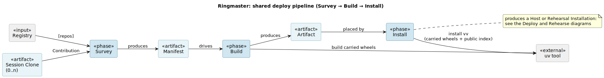
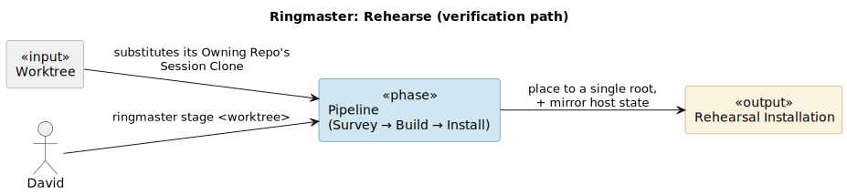
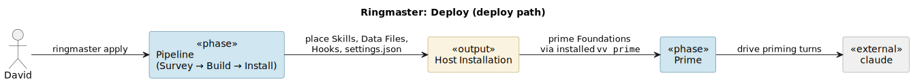

# Ringmaster: architecture

This is a spec: high-level WHAT. Low-level WHAT is in the test suite; HOW is in the code.

Ringmaster is the assembly layer that produces and deploys the integrated Vaudeville installation. The operator drives a deploy as a Session bracketed by Clone and Discard: `ringmaster clone` opens the Session, `ringmaster stage <worktree>` materializes a Rehearsal Set the operator audits and smoke-tests, the Session forks on the smoke result, and `ringmaster discard` closes it. The rehearsal cycle is the [`/rehearse` skill](../../.claude/skills/rehearse/SKILL.md); Deploy remains the operator's call after `/rehearse` reports. Terms in [`ul.md`](ul.md).

## The Session is Ringmaster's only carried state

The Session Clones Clone produces are the only state Ringmaster carries between commands, and only between commands of the same Session. They are not an input: every Session begins with Clone, which destroys any leftover Session Clones before fresh-cloning, so nothing done to them outside a Session survives. They are not durable: Discard removes them at Session close. Because no command except Clone writes to them and Clone always starts from a clean slate, the asymmetric "some-commands-refresh, others-don't" model a persistent shared scratch would invite cannot arise.

Within a Session the Session Clones are writable for one reason: applying a Rehearsal Fix to a failed smoke, which the next Rehearse picks up. Deploy refuses a Rehearsal-Fixed Session Clone; the Host Installation only ever reflects reviewed, merged code.

## The Session forks on the smoke result

The smoke either clears with zero Rehearsal Fixes or it does not, and that distinction determines what the Session does next.

- **Smoke cleared with zero Rehearsal Fixes:** Deploy runs immediately. The Session Clones are byte-for-byte each Contributor's `origin/main`; the deploy is code the operator already approved by merging the upstream PRs.
- **Smoke required any Rehearsal Fix at all, even one character in one file:** Deploy is blocked. Each Rehearsal Fix is productionized as a PR, reviewed and merged by the operator into the relevant Contributor's `main`, and re-pulled into a fresh Session Clone by another Clone before Deploy runs.

The Pristine guard in Deploy is a backstop. The binding rule is the discipline: the agent stops at any Rehearsal Fix and waits for the merge cycle, regardless of what the CLI would allow.

## Contribution encoding

A Contributor encodes each Contribution slot at a fixed location inside its repo, under a `scaffold/` tree — the Contribution Layout: the placement contract a Contributor follows, published here rather than left to the discovery modules that read it. Skills go under `scaffold/.claude/skills/`, Data Files as flat files under `scaffold/.vaudeville/`, Doc Trees under their fixed name (`scaffold/doctrine/`), and Hook Scripts under `scaffold/.claude/hooks/`, with their firing conditions in `scaffold/.claude/hooks.json`, whose shape is the `hooks` key of Claude Code's `settings.json`, each command referencing its Hook Script through the literal `$VV_HOOKS_DIR` placeholder. A Contributor's CLIs are declared in its `pyproject.toml`: the entry points in `[project.scripts]`, with a `[tool.vaudeville]` CLI Declaration whose presence marks the Contributor as part of the federated command line. Its `binary` names which entry point is the `vv` app, and its optional `operator_binary` names which is the operator app the `vaudeville` CLI composes. The command Surface each Facade exposes is whatever its CLI app actually defines; Ringmaster reads it from the app at build time, never from a hand-maintained list, so it cannot drift from the code and grows as the Contributor grows.

## Rehearsal Set as the verification gate

`ringmaster apply` installs the Host Installation, but by the time it runs the question "does the integrated set work?" must already be settled; Deploy is not where breakage gets caught. Rehearse settles it first: it composes a Rehearsal Set and installs it as a Rehearsal Installation structurally identical to what Deploy would install, against which both the Audit and the lifecycle smoke run.

Whether a clean install also left a host that can actually be deployed-from is a separate question, answered after a Host install by Commissioning (the carried installer runs it, described below). Commissioning's Surface and Foundation checks cover the installation — does the installed `vv` self-report a non-empty Surface, were any Foundations left stranded — while its Host-wiring Check covers the host *environment* the steps after it reach into: that the tracker authenticates, the tenant's own Component remotes are readable, and Workmux runs. The bar there is read-only wiring, not the Contributor operations themselves: it probes the access Priming's clone and a `vv spawn`'s `workmux add` need, without their side effects.

## Build produces the Artifact; Install places it

Rehearse and Deploy share one pipeline (Survey, Build, Install) differing only in the Destination. Survey is read-only and the single site at which a colliding federation is rejected.

**Build is the proprietary half.** It integrates the Manifest and the Contributor sources into an Artifact: one self-contained unit carrying the collected Contributions and the integrated command line as installable code, built from source. Building the carried code from source is what lets the Artifact install against public PyPI alone: the one Vaudeville distribution that lives on a private index (`vaudeville-core`) rides inside it rather than being fetched. It also carries the Installer as its own distribution, so the Artifact is self-installing: a party with the Artifact and `uv` activates the carried installer to place it, no integrator present. The Contributor decomposition dissolves here; the Artifact knows nothing about where it will be installed.

**Install is the common half.** It places an Artifact at a Destination, preserving operator-curated state on the Host while owning the framework directories it rebuilds wholesale. Build is proprietary to Vaudeville-the-project; Install is common to every tenant: a tenant installs an Artifact it was handed and never runs Build, because the Artifact carries the Installer that places it. The Artifact is the seam that makes that split structural rather than merely intended: because the means to install travels inside it, the integrator assembles a self-installing Artifact and never travels with it.

## Deploy and Rehearse install through the carried installer

Deploy and Rehearse do not place the installation themselves. Each Surveys its Manifest, builds the Artifact, and then activates the installer carried inside it against the Host (Deploy) or a Rehearsal root (Rehearse). Every deploy therefore walks the exact self-install path a tenant runs, and there is no second integrator-only install path to drift from it.

The installer owns placement and, for a Host install, the Commissioning that leaves the host deployable-from: Spawn and Fork reseed a new Bob from its Contributor's primed Foundation, so a placed-but-unprimed host would fail at the first `vv spawn`/`vv fork`. The installer runs Commissioning — Surface Check, Host-wiring Check, Priming, Foundation Check — running Priming against the Host's own Claude state even when Deploy runs in a rehearsal shell pointed at a Rehearsal Installation (the Rehearsal Redirect is stripped first). A Rehearsal install is placement only; its verification is the smoke. Priming itself remains BOB's `vv prime`, reached by subprocess through the installed Facade; the installer does not decide which Foundations exist.

Rehearse and Deploy each open from that pipeline and add only their own tail.

## Publish puts a Release in the Published Home

Deploy and Rehearse consume Build by *installing* the Artifact; Publish consumes it by *shipping* it. Publish runs Deploy's front half (Pristine guard, then build) but instead of handing the Artifact to its carried installer, publishes it as a Release on the Published Home: the same Artifact, packed as the Release's versioned download for other Tenants to download and self-install. The Pristine guard binds here for the same reason it does in Deploy: a Release, like a Host Installation, carries only reviewed, merged code.

Publish is deliberately decoupled from Deploy: the two share that front half, but neither gates the other, a coupling left open by design.

## Publish also commits a readable Exposition beside the install Artifacts

The Release's Artifact carries the integrated code as built wheels: installable, not readable. So Publish renders a second emission from the same Session Clones: an Exposition, a for-reading rendering of the assembled source committed *into* the Published Home's tree. A reader browses the whole constellation at a Release's tag without cloning each Contributor Repo: `subsystems/` (the lifecycle Contributors), `doctrine/` (the universal Doctrine), `machinery/` (the integrator and the boundary Contributor). Each Contributor's `src`, any workspace `packages` it ships (such as vaudeville-ringmaster's carried installer, built into every Artifact), its own `scaffold`, `docs`, and `README` are gathered; tests, tooling, and history are not. The Section-to-Contributor placement is editorial, declared in a layout and validated to cover the Registry exactly, so a newly registered Contributor forces a placement decision rather than slipping out of the rendering.

The two emissions share one Release Name and one commit. Publish commits the Exposition to the Published Home first and captures that commit's SHA, then creates the Release pinned to it (`gh release create --target <sha>`) rather than letting the tag resolve to the default branch's head at release time, so a concurrent push to the Published Home cannot steal the tag and leave one Release's asset against another commit's source. Browsing the repository at tag `vX` shows `vX`'s source, and the Release `vX` carries `vX`'s install Artifact as its asset. The Exposition commit is created before the Release, so a failure after it leaves an untagged commit the next Publish supersedes rather than a Release with no readable companion; the Release Name, computed from the tag namespace, is not burned.

The Exposition is a reading copy, deliberately not the build input: it is reorganized by role, trimmed of tests, tooling, lockfiles, and history, and regenerated whole each Publish. What a Release was actually built from is the [Provenance](ul.md#provenance) at the Exposition's root, which records a different set than the Exposition renders. The Exposition shows the whole constellation by role; the Provenance records only the **carried Contributions** (those whose source the Artifact holds) derived from the same definition Build places from. So the integrator appears in the Exposition as `machinery` but never in the Provenance's carried record: it is the Builder, recorded only as the version that stamped the Facade and built the installer, never as a payload.

## The Facade is one tool

The deployed `vv` is a single program whose subcommands are the union of every Contributor's CLI app, each routed in-process to its owning app. A Contributor's skills invoke `vv` subcommands another Contributor implements as subprocess calls, so the Contributors never import one another. The tenant sees one tool: the package decomposition behind it is Vaudeville-internal and does not survive into what installs, so a tenant never depends on that structure and Vaudeville is free to change it. `vv` and the operator's `vaudeville` are the two Facade instances, each the same composition under its own program name.

## The operator CLI

`vaudeville` is the operator's CLI, installed alongside `vv` and composed exactly as the `vv` Facade is: from each Contributor's operator app rather than from anything Ringmaster authors. A Contributor marks its operator app with `[tool.vaudeville].operator_binary` (the operator counterpart to the `binary` that marks its `vv` app) and the same dispatcher unions those apps under the `vaudeville` program name. It is a curated surface, deliberately separate from `vv` and free to diverge from it; operator commands and their affordances are the Contributors' own, so Ringmaster owns the composition and no operator-command logic.

## Convention notes

Diagrams are authored in PlantUML under [`architecture/`](architecture/) and rendered to SVG by [`scripts/render-spec.sh`](../../scripts/render-spec.sh), which is canonical on how to render them and what to commit. Shared element definitions live in [`architecture/elements.puml`](architecture/elements.puml): the PlantUML projection of the Ubiquitous Language in [`ul.md`](ul.md), so element identity is defined in one place. Write tildes in label paths as `&#126;`; PlantUML's creole parser eats a `~` followed by punctuation otherwise.
