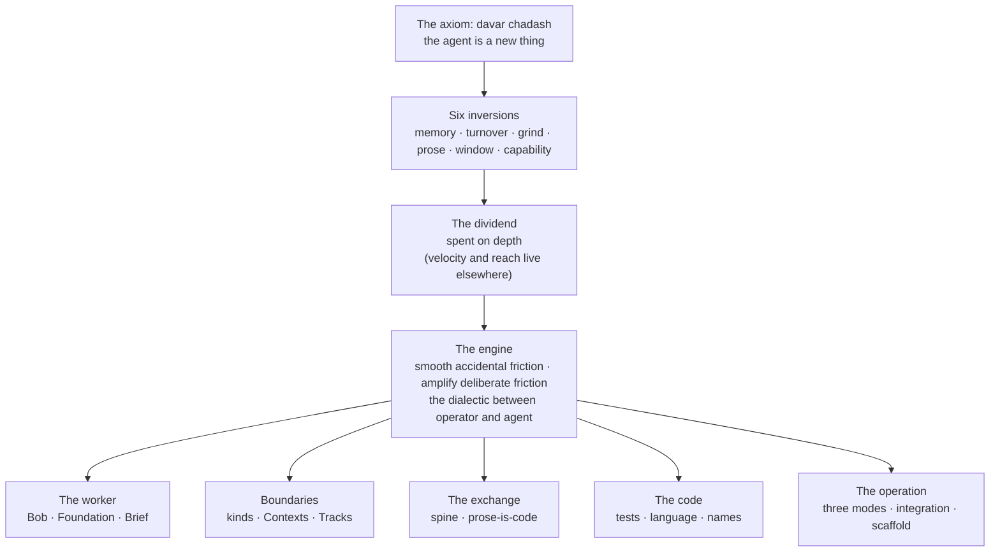

# The Map of Vaudeville

This is a derivation tree rooted in a single axiom, not a list of features. Every Vaudeville practice is an engineering practice re-derived from the AI agent's cost structure rather than the human's, in service of one choice — the substrate's dividend spent on depth — and each derivation lands in one of three places: on the familiar answer, on an answer the industry abandoned, or on an answer with no precedent.

One axiom, six substrate facts, one choice about what to buy with them, one engine, and every practice a branch. The sections below walk it top to bottom.

## The axiom

The agent is a *davar chadash* — "a new thing," a case existing reference classes do not reach ([doctrine/bearing/davar-chadash.md](doctrine/bearing/davar-chadash.md)). Software-engineering practice is calibrated to humans writing code, management practice to persistent living beings; both break against the agent, not the other way around. The mechanism of the break is entanglement: precedent bundles facts that were only ever coupled in humans, and the substrate decouples them, so what reads as one incontrovertible truth is often two. Integration toil was entangled with integration frequency until grind became cheap; working memory was entangled with world-coherence until a curated context window could hold a working world whole. Every practice therefore gets re-derived from the substrate up, and the framework looks most anachronistic exactly where the substrate diverges most from the human case.

## The derivation engine

Six inversions of the human cost structure do all the deriving. Each row is a fact about the substrate, and every practice below is one or more rows worked through to a conclusion.

| Dimension | For the human | For the agent |
| --- | --- | --- |
| Memory | Accumulation is an asset; the question is what can be recalled | Accumulation is contamination; the question is what is admissible |
| Turnover | The organization's catastrophe | The design center |
| Grind | A cost to eliminate | A resource to spend |
| Prose | Read for sense | Executed as a program |
| Context window | A small, leaky working memory | The totality of a curated working world, holdable at once |
| Capability | Roughly uniform; fails obviously | Frontier-grade but uneven; fails plausibly, and blurs things that merely sound alike |

## The dividend

There are three things to want from a coding agent. **Velocity**: building what you already understand, fast. **Reach**: building what you do not personally know how to build, but the model does. **Depth**: building systems whose parts are individually intelligible while the whole exceeds what one mind can hold in stable relation — software you can glimpse but not carry. The mainstream tools serve the first two well, and nearly all software wants nothing else. Vaudeville spends the entire dividend on the third — and the third is a frontier, not a niche: the class of work that was never economical to attempt, because coherence at that interaction density could not be bought at human prices. Most software does not need this framework; the software that has not been possible until now does.

## The engine

Two minds run the work, and the design names both halves. The operator adjudicates meaning — chooses names, accepts and rejects framings, decides which distinctions matter — and does not walk away, because the operator is not this machine's supervisor but half of it. The agent holds the whole: the one party whose curated window can carry the entire system at once. That is the common intuition about coding agents — good for prototypes, blind to the big picture — turned exactly on its head, and the system is built to keep the agent in that role against its own trained reflexes, by giving it the right context and the right purpose. Between the two halves runs the operating rule, an asymmetry applied to every piece of friction the work generates:

| Friction | Fate |
| --- | --- |
| **Accidental** — toil, setup, bookkeeping, navigation, integration grind | Driven toward zero by machinery |
| **Deliberate** — the seams where two understandings diverge | Amplified, and handed both parties' freed attention |

What runs in the cleared space is the dialectic: sustained, opposable argument in which misunderstandings surface and are mined for what they carry. The friction is the product — the argument is where the work gets done that neither party could have done alone — and the coding, when the engine is running, is residue.

## The target

Depth is the target; coherence is its containment layer. Meaning corrupts across lossy hand-offs — specs into assignments, assignments into priming, priming into work, work into code — and a fix at the producer end of that chain compounds across every downstream read, while a fix at the consumer end helps once, at the read site ([doctrine/practice/signal-side-leverage.md](doctrine/practice/signal-side-leverage.md)). So the apparatus maximizes preserved meaning per boundary crossing — but it would be natural to stop there, conclude that this is a preservation discipline, and miss the point: a perfectly coherent system can defend a mediocre ontology forever. Coherence keeps the depth already won from corrupting across a parade of ephemeral acts; the engine above is what wins it.

## The worker

**Ephemeral workers, compiled context.** The working unit is a [Bob](doctrine/vocabulary.md#bob): an ephemeral agent session spawned onto one piece of work and gone when the work is delivered. Turnover, a human organization's catastrophe, is here the design center — and it converts the memory question from recall to admissibility, because a true fact can still poison the current frame by smuggling in a wrong ontology or a stale authority. So a Bob's context is compiled, never accumulated: it forks from a [Foundation](doctrine/vocabulary.md#foundation) — the primed base session of its [Component](doctrine/vocabulary.md#component), the part of the system it works within, every assumption admitted deliberately and in order — and reads a [Brief](doctrine/vocabulary.md#brief), the one thing this Bob is for. Everything in its head at the first turn was put there on purpose. No precedent: no human organization could compile its workers' minds, so none ever asked what belongs in one.

## Boundaries: kind, space, time

Three derivations are jurisdictions — over the kind of work, over meaning in space, over divergence in time — because when the window's contents are the only control surface, boundaries are the lever you have.

**Assignment kinds and Routes.** A ticket hands over one undifferentiated unit of work and trusts the reader to sort its modality through hallway context a Bob does not have. Vaudeville carves the ticket by where discretion lies: a [Premise](doctrine/vocabulary.md#premise) (the goal itself still open to contest), a [Direction](doctrine/vocabulary.md#direction) (ends settled on one named assumption, means open), a [Command](doctrine/vocabulary.md#command) (both settled; executed rather than pressed), a [Manual](doctrine/vocabulary.md#manual) (nothing delegated; the operator steers live) — with a [Route](doctrine/vocabulary.md#route), constrained by kind, declaring in advance what shape of conversation the work expects. The acceptance-criteria ban: a model trained on the world's project-management artifacts treats any AC-shaped list as the contract no matter how it is hedged, so the reflex cannot be repaired at the reading end and the rule falls on the only end where correction is possible, the author's. An unprecedented re-carving of familiar ticketing.

**Contexts and Tolerances.** A language model is a pattern-completion engine, and words drag worlds behind them: let one domain's vocabulary leak into another and the model quietly blends their ontologies, building the nearest familiar thing instead of the actual system. So the Components that adjudicate a domain are [Contexts](doctrine/vocabulary.md#context) — bounded contexts with harder teeth, because here the boundary is not a team convention but the control surface itself. The discipline is facilitation, not control: [Tolerances](doctrine/vocabulary.md#tolerance), slack designed in — a clearly named remit inside which the agent is free, because a part machined too precisely does not fit better, it binds, and micromanaged judgment binds the same way. The familiar DDD answer, kept because the substrate raised its stakes.

**Tracks and the publication gate.** A [Track](doctrine/vocabulary.md#track) is a jurisdiction in time: a divergence from main held jointly by the work that carries it, invisible to everyone else until published. The underlying fact is about windows: a divergence held whole in one context window is coherent, and the same divergence spread across windows that do not share it is poison, because an agent reasons from the names in front of it. The governing invariant is the publication gate — meaning must be present in main before anything outside the Track builds against it. This is the abandoned answer, long-lived branching, the very thing continuous integration was invented to kill, re-derived with the discipline humans could not keep on a substrate that can.

## The exchange

**The spine.** The engine's argument has value only if the agent actually opposes: human and agent are unreliable in usefully different ways, and a fluent concession surfaces nothing — agreeable concession is not a courtesy but corruption of the only signal the exchange produces. Hence the spine ([doctrine/bearing/spine.md](doctrine/bearing/spine.md)): positions held under pressure, pushback classified before it moves anything, "you're right" reserved for substantive claims. Dialectic as the engineering method itself, rather than a communication style around it, has no precedent.

**Prose is code.** Agent-facing prose is not writing the agent reads; it is a program a stochastic interpreter runs ([doctrine/practice/prose-is-code.md](doctrine/practice/prose-is-code.md)). Near-synonyms are different programs; the same wording is a different program against a different context; and nothing about a wording can be learned by reading it back — only by running it and judging what it produced. The order of trust runs from the run first to the wording last. Unprecedented, because nothing in the human world executes prose.

## The code

**What the substrate kept.** Some derivations run their full course and land exactly where XP and DDD landed, for reasons the substrate makes stronger rather than weaker. Tests as contracts: a test states a unit's promise in domain terms, and it is the one specification a stochastic reader cannot charitably misread ([doctrine/code/tests.md](doctrine/code/tests.md)). Ubiquitous language: a synonym is a crack where a blended ontology hides, so one concept gets one name ([doctrine/code/language.md](doctrine/code/language.md)). Names that hit you over the head: the code's reader completes patterns, so literate names are load-bearing, and a comment needed to explain a function marks a wrong name, not a missing comment. Correctness over expedience, because a substrate that fails plausibly turns every shortcut into a latent defect. Familiar answers, held on purpose rather than by inertia: the axiom is a derivation engine, not a novelty engine.

## The operation

**Three modes of intervention.** All coordinated work sorts into three homes ([doctrine/practice/three-modes.md](doctrine/practice/three-modes.md)): deterministic process into tooling, because an agent improvising a rote procedure does it worse than the tool; bounded judgment into skills, procedures that give a conversation a shape the agent's judgment fills; unbounded judgment into open conversation, where no scaffold should intrude, because nothing outscaffolds the model on its native terrain. Skills hollow out over time, their stabilized parts compiling into CLI verbs, and the hollowing is health: judgment evaporating into machinery. An unprecedented sorting — the human world never had to decide which of its work was secretly deterministic.

**Stochastic integration and the two greens.** Continuous integration was the correct answer to a human curve: integration pain worsens with batch size, and for humans that curve was steep enough to harden integrate-always into dogma. Cheap grind flattens the curve without erasing it, demoting continuous integration from rule to the limit case of a batch-size dial ([doctrine/vocabulary.md#stochastic-integration](doctrine/vocabulary.md#stochastic-integration)). Working the dial splits green — the state of passing one's checks — in two: Component-green, continuous and contract-level, what a repository's own CI asserts on every PR; and integration-green, episodic and judged, what an integration event asserts about the assembled whole. Any fix made while integrating is a spike — exercised, never shipped — that flows back as a reviewed, merged PR. The abandoned answer, episodic integration, re-derived.

**The scaffold and the wager.** When an agent fails — drifts off a framing, hallucinates a spec, ships confidently wrong code — the correction lands in the scaffold (skills, specs, vocabulary, priming, tooling), never in the verdict that the agent should have done better ([doctrine/practice/no-behavioral-issue.md](doctrine/practice/no-behavioral-issue.md)). That is familiar high-reliability practice: fix systems, not personnel. Beneath it sits the framework's one named falsifiable bet: agents are not strategic adversaries — the real failure modes are drift, hallucination, and misunderstanding, not malice ([doctrine/practice/trust-posture.md](doctrine/practice/trust-posture.md)). The containment is structural and does not depend on the bet: isolation bounds the blast radius, an off-machine review loop screens every action, and human oversight sits at the outcome layer. The method — the whole meaning-carrying apparatus — depends on the bet completely, which is why it is named rather than silently assumed.

## How to use this map

The tree: one axiom, six inversions, one dividend spent on depth, one engine, and every practice a branch whose why can be reconstructed from the table's rows. This document exists because the agent can hold the whole of the system at once, so you do not have to. When the map is not enough, three bodies sit beneath it. The law lives in the primary doctrine tree, the compressed texts primed into every agent: the axiom and the agent's bearing under [doctrine/bearing/](doctrine/bearing/), the code discipline under [doctrine/code/](doctrine/code/), the methodology under [doctrine/practice/](doctrine/practice/), and every coined term this map leaned on defined once in [doctrine/vocabulary.md](doctrine/vocabulary.md). The deep arguments — each derivation pressed at essay length, with its evidence — live in the [theory essays](theory/). The operations — the verbs, the lifecycle, how a show is actually run — live in the manual. Map for the whole; doctrine for the law; theory for the argument; manual for the act.
