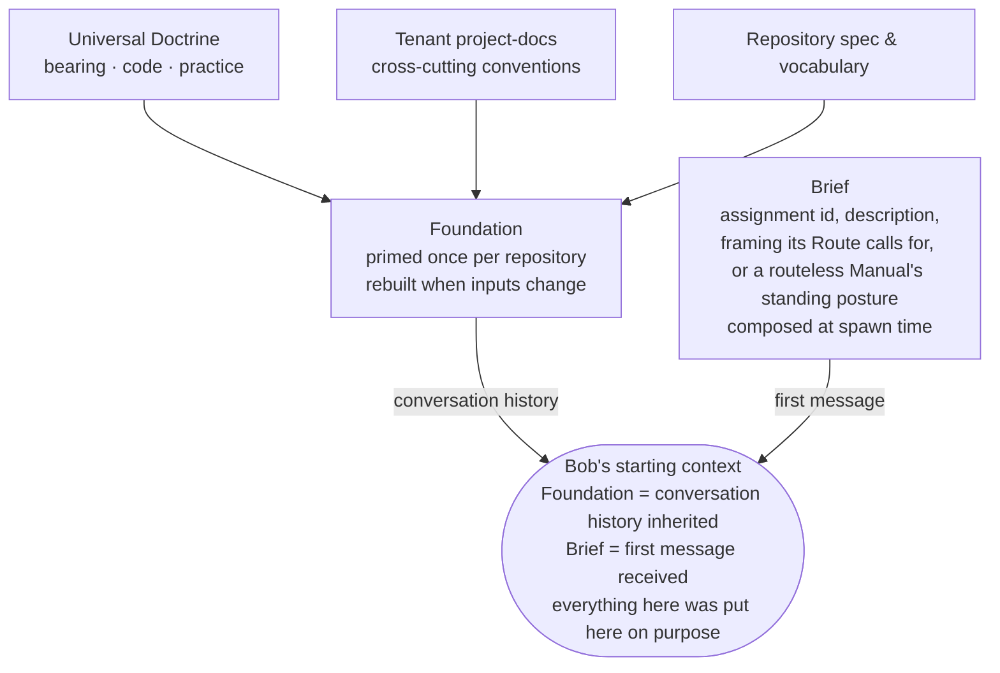
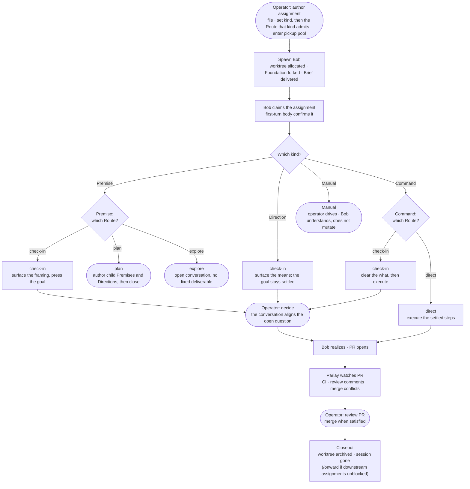
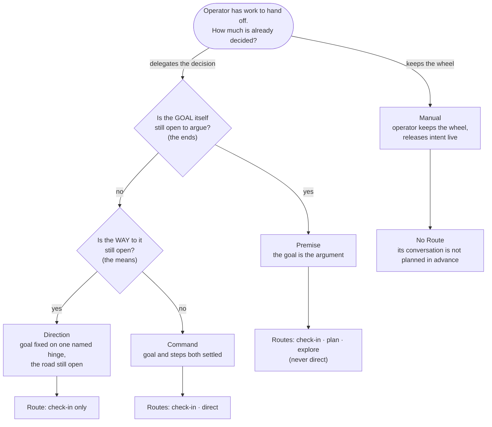

# Workflow

[The point](./the-point.md) argues why this framework exists and for what class of work; [prerequisites](./prerequisites.md), whether you should adopt it; [concepts](./concepts.md) builds up the vocabulary: what a Bob, an Assignment, a Route, a Foundation are, and how the terms connect into one system. This document sets that vocabulary in motion. It covers the day-to-day operation of a Vaudeville project, the arc a single piece of work travels (most often a filed Premise pressed to a merged change, though it branches by kind and route), and what the operator is actually doing at each junction. Read [concepts](./concepts.md) first if the terms below are unfamiliar; this is the same world seen as a sequence of moves rather than a set of parts.

## The context problem

Every [Bob](doctrine/vocabulary.md#bob) (a fresh Claude Code session spawned into its own worktree) starts knowing nothing. No memory of the last session that worked this repository, no record of decisions made last week, no intuition for the direction the system is heading. This is not a limitation being managed; it is the point. A Bob that carries no ambient memory is one whose starting context can be *compiled*: every assumption in its head put there on purpose, rather than accumulated by whatever happened to stick.

The question the framework answers is not "how do we give agents better memory?" but "how do we compile the right starting context for each piece of work?" The answer has two parts, called the Foundation and the Brief.

## What a Bob starts knowing

The **[Foundation](doctrine/vocabulary.md#foundation)** is the primed Claude Code session every Bob spawned into a given repository forks from. Priming works by replaying a controlled sequence of source materials as conversation history (the universal Doctrine first, then the tenant's cross-cutting project-docs, then the repository's own spec and vocabulary) so that when a Bob wakes up, it has internalized the framework's discipline, the project's conventions, and this repository's domain. Not as prose it will reason about from scratch, but as lived context it already holds. One Foundation per repository, rebuilt whenever its inputs change.

The **[Brief](doctrine/vocabulary.md#brief)** is the first message the newly-spawned Bob reads: the assigned assignment's id and description, and the framing its Route calls for, or, where the assignment is a routeless Manual, the standing posture it carries instead. It is composed at spawn time from the assignment, and it is the only work-specific information in the Bob's head at the start; everything else came from the Foundation. Together they constitute the entirety of what a Bob starts knowing: the Foundation is everything it inherits, the Brief is the one thing it is for.

This pairing is the framework's answer to the question other systems answer with "memory," and the difference is not incidental. Memory asks what can be recalled; the context model asks what is *admissible*. A fact can be true, relevant somewhere, and still poisonous in the current frame because it smuggles in the wrong ontology or a stale authority. Ambient memory is treated here as contamination. The Foundation is the clean room every act steps into.

## The assignment, and why it is not a ticket

The unit of work assigned to a Bob is an **[Assignment](doctrine/vocabulary.md#assignment)**, and it comes in four kinds, told apart by where the operator has left discretion: a **Premise** when the goal itself is still open to argue, a **Direction** when the goal is settled on one named assumption but the way there is open, a **Command** when goal and steps are both settled. Off that line entirely sits a **Manual**, when the operator delegates neither question and keeps the wheel. [Concepts](./concepts.md) builds that distinction up; here it is enough that the kinds exist, because the lifecycle below branches on them.

None of the four is a ticket. A ticket assumes the change has been framed (here is the work item, implement it, verify the expected behavior) and hands that one shape down whatever the work actually needs. That holds for routine work and collapses for deep work, where the framing *is* most of the problem, and where the four kinds are exactly the modes a single ticket runs together. The Premise is the kind that keeps the framing open, and the one this lifecycle leans on, so the rest of this section is about it.

A Premise is a proposition under which a change might be worth making, offered by one fallible voice at one point in time. The Bob is expected to read it, cross-check it against the live code (the authoritative tiebreaker when Premise and code conflict), form its own judgment, and surface disagreement before proceeding. The Premise gives situational awareness, not orders.

Two things follow. First, **[acceptance criteria](doctrine/vocabulary.md#acceptance-criteria) are banned from it**. A model trained on the world's project-management artifacts cannot help treating a list shaped like acceptance criteria as a contract, regardless of surrounding hedges. The reflex lives downstream of training where no instruction can reach it, so the only end of the channel where it can be corrected is the author's. (A Command, whose authority is already settled, is rightly built from exactly such ordered steps; the ban is the Premise's alone, because a Premise that grows them has quietly turned into a Command.) Second, the measure of a Premise is not whether its framing was correct, but whether it gave the right starting context: a wrong framing that surfaced disagreement early has done its job, while a Premise the Bob silently followed into wrong work has failed even if its framing was technically defensible.

Practically: a Premise contains a short framing of the work in domain terms, the relevant context and open questions, and (optionally and clearly marked as fallible) the author's sketch of what a good outcome might look like. It does not contain specifications of mechanism, tracker dependency references that duplicate what the graph already carries, or full conversation transcripts. The author's job is to identify the slice of context the Bob actually needs; distilling a conversation down to what was essential, and discarding the rest, is itself a form of judgment.

## The lifecycle

An assignment is filed in the tracker with its kind set (and, where its kind takes one, its Route) and enters the pickup pool. Spawning a Bob pulls it from the pool: the system allocates a worktree, starts a fresh Claude Code session forked from the repository's Foundation, and delivers the Brief as the Bob's first message.

The Bob claims its assignment in the first turn (recording that it has read and understood it), then works it according to its kind and the Route that kind allows. A **Premise** holds the framing open: on **check-in** it surfaces the decisions and open questions before acting, and once the operator answers, it realizes; on **plan** it opens the scoping with the operator, then authors a set of new Premises and Directions rather than code and closes once they exist; on **explore** there is no fixed deliverable: it gives a hot take and follows the conversation wherever the work goes. A **Direction** always takes check-in, but a narrower one: the goal is settled, so the conversation works out the means rather than reopening the end. A **Command** is executed rather than pressed: **direct** when the operator wants it run straight to completion, **check-in** when the *what* should be cleared before the work merges. A **Manual** keeps the operator at the wheel: the Bob spawns primed and seeded with deferred instructions, builds understanding and raises questions, and mutates nothing until the operator directs it.

Once a PR is open, the `/parlay` [skill](doctrine/vocabulary.md#skill) watches it: monitoring review comments, merge conflicts, and CI failures, and addressing each as they arrive. When the PR merges, the Bob closes out with `/closeout delivered`, or uses `/onward` to simultaneously close and spawn Bobs on whichever downstream Assignments this one's merge unblocked. Either way, the worktree is archived and the session is gone.

The operator's role across this is not line-by-line oversight of what the Bob does, but presence at the junctions where meaning is at stake: the check-in where a decision crystallizes, the PR review where the framing meets the implementation. Between those junctions, the Bob drives.

## Classifying the work: kind, then route

Two questions, asked when the assignment is filed, sort it. They are the same two the [concepts](./concepts.md) guide builds out, drawn here as the decision the operator actually makes:

The first split is the kind; the Route falls out of it. This is the decisive point: the [**Route**](doctrine/vocabulary.md#route) is not a free attribute every assignment carries the same way; it is a property each kind constrains. A Premise may take check-in, plan, or explore but never direct; a Direction takes check-in only; a Command takes check-in or direct; a Manual takes none. Read the diagram top to bottom and the route options come out of the kind, never the other way around.

Route is the coordination-level classification, fixed before the working session exists, and it has a session-level counterpart the operator never sets: once a Bob is working, *how* it realizes the work in hand is its own classification, called Procedure, chosen inside the session. [Concepts](./concepts.md) draws out that parallel; here the concern stays on the part the operator acts on. The four route values, by what conversation each expects:

**direct**: mechanical and CI-gated, with no decision point worth surfacing; the Bob realizes without a check-in. A Command's path when the operator wants it run straight to completion; most dependency updates and well-specified scaffolding belong here.

**check-in**: at least one bounded decision point where human judgment is wanted before the work merges. Not a sign-off; it can carry substantive discussion, but it is bounded, and it ends in a realized deliverable. It is the one route every delegating kind can take: a Premise pressing its goal, a Direction working out its means, a Command clearing its *what*.

**plan**: the deliverable is architecture, not code. Because scope is the work the operator deferred, the Bob opens the decomposition with the operator before forming it (surfacing the open scoping questions, not a finished design), then authors the set of new Premises and Directions and closes once they exist. Plan is how decomposition gets delegated: instead of specifying every child up front, the operator describes the problem and the Bob finds the right shape, the scope settled together before any child is filed. Only a Premise takes it.

**explore**: the starting point for unbounded conversation. No fixed deliverable, no `/realize` step. Explore exists because open-ended human-agent conversation is first-class work, not a scaffold failure to be engineered away: when judgment is genuinely unbounded, the frontier model's native conversational capability is the best instrument available, and the framework's job is to get out of the way. Only a Premise takes it.

A **Manual** carries no route at all, which is why it sits off to the side of the diagram: it expects no conversation planned in advance. The Bob spawns primed and seeded with instructions the operator wrote but chose to defer, proactive about understanding but not about mutating: it reads, investigates, and raises questions, but changes nothing until the operator directs it. The framework's job there is to position an oriented agent, not to drive it.

The common misclassifications live at the kind boundary as much as the route one. Filing as a check-in Premise a goal that is in fact settled (where the only thing open is *how*) burns the conversation re-litigating an end nobody is contesting; that work is a Direction. Filing a fully decided, mechanical task as a check-in at all, when it should be a direct Command, spends a conversation on a rote process. And routing a genuinely open problem through check-in when it wants explore compresses a dialectic into a one-shot exchange: exactly what the dialectic exists to prevent.

## Skills: the procedural layer

A **[Skill](doctrine/vocabulary.md#skill)** is a documented procedure an agent invokes by name: `/file`, `/realize`, `/closeout`, `/parlay`, `/onward`, and others. A skill structures a procedure without reducing it to deterministic code: scaffolding that gives the work a shape, filled in by the agent's judgment.

Their position in the system follows from a three-way sorting the framework applies to all work: deterministic processes belong in tool calls (the `vv` CLI is the canonical home), bounded judgment belongs in bounded conversations with a defined shape (which is where skills live), and unbounded judgment belongs in open conversation where no scaffold should intrude. Skills occupy the middle tier.

They are explicitly waypoints toward rote delegation, not destinations. When a piece of what a skill exhorts stabilises into something fully mechanical (the `vv assignment-claim` call at the start of every Bob's first turn, for instance) it is compiled out of the skill and into a CLI verb. A mature skill hollows out over time, judgment evaporating into tooling, and that hollowing is the sign of a healthy system: less of the important structure depending on agent discretion, not more.

## How it composes in practice

A day's work on a Vaudeville-managed project does not look like "write prompts and review diffs." It looks like playing chess against ten or twenty opponents simultaneously.

At any given moment there are 10-20+ Bobs running at one stage or another. Agent turns rarely complete in under two minutes and the hard ones can run thirty or more; that latency is what makes the parallelism possible and sustainable. You tab between windows as turns complete: most are check-in Bobs, each mid-conversation on a different Assignment, each waiting for you to press the framing, decide the open question, or say go. The direct Bobs (a Command run to completion, a dependency bump, a well-specified scaffold) run without your attention and deliver PRs when they are done.

The shape of the workload has a tidal quality. When `/onward` runs at the close of a significant Assignment, it frequently fans out into more than one child: the parallelism expands. As a related sequence of Assignments completes and its children close out, the count drops. When it drops far enough that the remaining Bobs can no longer fill the space between your turns, it is time to start the next set (file a cluster of new Assignments, or spawn on the ones already queued) and the tide comes back in.

Explore Bobs are rare in this kind of depth-work tenancy, where almost every problem has a deliverable waiting at the end of it. They become more common in different terrain: infrastructure-as-code work, for instance, where the difference between spike and production can blur.

Your attention concentrates at the places where meaning is at stake: the check-in where a decision crystallizes, the PR review where framing meets implementation, the closeout that resolves what the work found. Everything else (the worktree lifecycle, the PR mechanics, the CI loop, the status transitions) is machinery. The framework exists to make that concentration possible: maximize friction against the unresolved conceptual problem, minimize it everywhere else.
