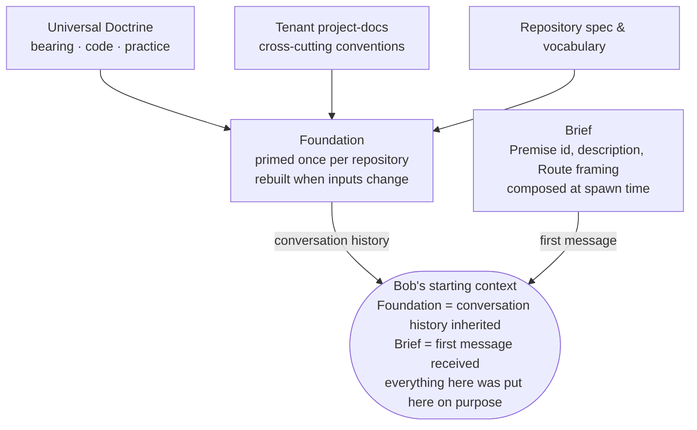
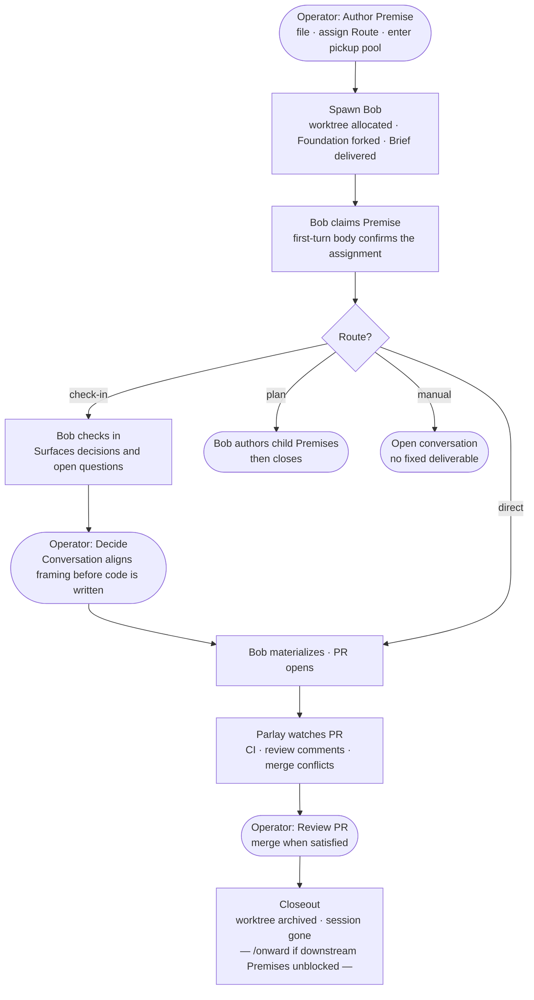
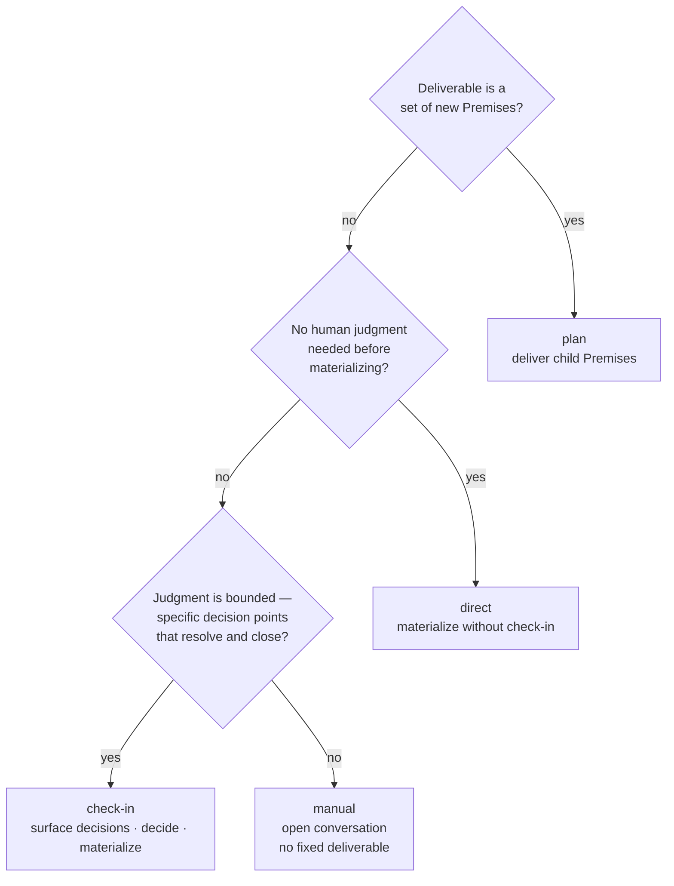

# Workflow

[The point](./the-point.md) argues why this framework exists and for what class of work; [prerequisites](./prerequisites.md), whether you should adopt it; [concepts](./concepts.md) builds up the vocabulary — what a Bob, a Premise, a Route, a Foundation are, and how the terms connect into one system. This document sets that vocabulary in motion: the day-to-day operation of a Vaudeville project, the arc a single piece of work travels from a filed Premise to a landed change, and what the operator is actually doing at each junction. Read [concepts](./concepts.md) first if the terms below are unfamiliar; this is the same world seen as a sequence of moves rather than a set of parts.

## The context problem

Every [Bob](doctrine/vocabulary.md#bob) — a fresh Claude Code session spawned into its own worktree — starts knowing nothing. No memory of the last session that worked this repository, no record of decisions made last week, no intuition for the direction the system is heading. This is not a limitation being managed; it is the point. A Bob that carries no ambient memory is one whose starting context can be *compiled* — every assumption in its head put there on purpose, rather than accumulated by whatever happened to stick.

The question the framework answers is not "how do we give agents better memory?" but "how do we compile the right starting context for each piece of work?" The answer has two parts, called the Foundation and the Brief.

## What a Bob starts knowing

The **[Foundation](doctrine/vocabulary.md#foundation)** is the primed Claude Code session every Bob spawned into a given repository forks from. Priming works by replaying a controlled sequence of source materials as conversation history — the universal Doctrine first, then the tenant's cross-cutting project-docs, then the repository's own spec and vocabulary — so that when a Bob wakes up, it has internalized the framework's discipline, the project's conventions, and this repository's domain. Not as prose it will reason about from scratch, but as lived context it already holds. One Foundation per repository, rebuilt whenever its inputs change.

The **[Brief](doctrine/vocabulary.md#brief)** is the first message the newly-spawned Bob reads: the assigned Premise's id, description, and Route framing. It is composed at spawn time from the Premise, and it is the only work-specific information in the Bob's head at the start — everything else came from the Foundation. Together they constitute the entirety of what a Bob starts knowing: the Foundation is everything it inherits, the Brief is the one thing it is for.

This pairing is the framework's answer to the question other systems answer with "memory," and the difference is not incidental. Memory asks what can be recalled; the context model asks what is *admissible*. A fact can be true, relevant somewhere, and still poisonous in the current frame because it smuggles in the wrong ontology or a stale authority. Ambient memory is treated here as contamination. The Foundation is the clean room every act steps into.

## The Premise — and why it is not a ticket

The unit of work assigned to a Bob is a **[Premise](doctrine/vocabulary.md#premise)**. It is not a ticket, and the distinction is more than terminological.

A ticket assumes the change has been framed: here is the work item, implement it, verify the expected behavior. That assumption holds for routine work and collapses for deep work, where the framing *is* most of the problem. A Premise sits upstream: a proposition under which a change might be worth making, offered by one fallible voice at one point in time. The Bob is expected to read it, cross-check it against the live code — the authoritative tiebreaker when Premise and code conflict — form its own judgment, and surface disagreement before proceeding. The Premise gives situational awareness, not orders.

Two things follow. First, **[acceptance criteria](doctrine/vocabulary.md#acceptance-criteria) are banned outright**. A model trained on the world's project-management artifacts cannot help treating a list shaped like acceptance criteria as a contract, regardless of surrounding hedges — the reflex lives downstream of training where no instruction can reach it. The only end of the channel where the reflex can be corrected is the author's. Second, the measure of a Premise is not whether its framing was correct, but whether it gave the right starting context: a wrong framing that surfaced disagreement early has done its job, while a Premise the Bob silently followed into wrong work has failed even if its framing was technically defensible.

Practically: a Premise contains a short framing of the work in domain terms, the relevant context and open questions, and — optionally and clearly marked as fallible — the author's sketch of what a good outcome might look like. It does not contain specifications of mechanism, tracker dependency references that duplicate what the graph already carries, or full conversation transcripts. The author's job is to identify the slice of context the Bob actually needs; distilling a conversation down to what was load-bearing, and discarding the rest, is itself a form of judgment.

## The lifecycle

A Premise is filed in the tracker, assigned a [Route](doctrine/vocabulary.md#route), and enters the pickup pool. Spawning a Bob pulls it from the pool: the system allocates a worktree, starts a fresh Claude Code session forked from the repository's Foundation, and delivers the Brief as the Bob's first message.

The Bob claims the Premise in its first turn — recording that it has read and understood the assignment — then begins the work its Route prescribes. For a **check-in** Premise, it surfaces decisions and open questions in conversation before acting; the operator answers, and the Bob materializes. For a **direct** Premise, it materializes without a check-in and the operator's next touch point is PR review. For a **plan** Premise, the deliverable is a set of new Premises rather than code; the Bob authors them and closes. For a **manual** Premise, there is no fixed deliverable — the Bob checks in and the conversation follows wherever the work goes.

Once a PR is open, the `/parlay` [skill](doctrine/vocabulary.md#skill) watches it: monitoring review comments, merge conflicts, and CI failures, and addressing each as they arrive. When the PR merges, the Bob closes out with `/closeout delivered`, or uses `/onward` to simultaneously close and spawn Bobs on whichever downstream Premises this one's landing unblocked. Either way, the worktree is archived and the session is gone.

The operator's role across this is not line-by-line oversight of what the Bob does, but presence at the junctions where meaning is at stake: the check-in where a decision crystallizes, the PR review where the framing meets the implementation. Between those junctions, the Bob drives.

## Routes — how work is classified

The **[Route](doctrine/vocabulary.md#route)** is the coordination-level classification that determines the lifecycle's shape. It is set when a Premise is filed — before the working session exists — and governs everything downstream: what kind of conversation the work expects, what the deliverable looks like, where the operator's attention is needed. It has a session-level counterpart the operator never sets: once a Bob is working, *how* it realizes the work in hand is its own classification, called Procedure, chosen inside the session rather than fixed at filing. [Concepts](./concepts.md) draws out that parallel; here the concern stays on the Route, the part the operator acts on.

**direct** — the work is mechanical and CI-gated, with no bounded decision points worth surfacing. The Bob materializes without a check-in. Most dependency updates, scaffolding PRs, and well-specified refactors are direct.

**check-in** — the work has at least one decision point where human judgment is needed before materializing. The check-in is not a sign-off; it can carry substantive discussion. But it is bounded: there is a beginning, a middle, and an end, and the end is a materialized deliverable.

**plan** — the deliverable is architecture, not code. The Bob authors new Premises and closes once they exist. Plan Premises are how decomposition gets delegated: instead of specifying all the children up front, the operator describes the problem and lets the Bob figure out the right shape.

**manual** — the starting point for unbounded conversation. No fixed deliverable, no `/materialize` step. Manual exists because open-ended human-agent conversation is first-class work, not a scaffold failure to be engineered away: when judgment is genuinely unbounded, the frontier model's native conversational capability is the best instrument available, and the framework's job is to get out of the way.

The two common misclassifications are routing a deterministic task through check-in when it should be direct (wastes a conversation on a rote process), and routing a genuinely open problem through check-in when it wants manual (compresses a dialectic into a one-shot exchange, which is exactly what the dialectic exists to prevent).

## Skills — the procedural layer

A **[Skill](doctrine/vocabulary.md#skill)** is a documented procedure an agent invokes by name: `/file`, `/materialize`, `/closeout`, `/parlay`, `/onward`, and others. A skill structures a procedure without reducing it to deterministic code — scaffolding that gives the work a shape, filled in by the agent's judgment.

Their position in the system follows from a three-way sorting the framework applies to all work: deterministic processes belong in tool calls (the `vv` CLI is the canonical home), bounded judgment belongs in bounded conversations with a defined shape (which is where skills live), and unbounded judgment belongs in open conversation where no scaffold should intrude. Skills occupy the middle tier.

They are explicitly waypoints toward rote delegation, not destinations. When a piece of what a skill exhorts stabilises into something fully mechanical — the `vv premise-claim` call at the start of every Bob's first turn, for instance — it is compiled out of the skill and into a CLI verb. A mature skill hollows out over time, judgment evaporating into tooling, and that hollowing is the sign of a healthy system: less of the important structure depending on agent discretion, not more.

## How it composes in practice

A day's work on a Vaudeville-managed project does not look like "write prompts and review diffs." It looks like playing chess against ten or twenty opponents simultaneously.

At any given moment there are 10–20+ Bobs running at one stage or another. Agent turns rarely complete in under two minutes and the hard ones can run thirty or more; that latency is what makes the parallelism possible and sustainable. You tab between windows as turns complete — most are check-in Bobs, each mid-conversation on a different Premise, each waiting for you to press the framing, decide the open question, or say go. The direct Bobs — usually `/tangent --spawn` invocations that branch off narrow, self-contained work — run without your attention and deliver PRs when they are done.

The shape of the workload has a tidal quality. When `/onward` runs at the close of a significant Premise, it frequently fans out into more than one child: the parallelism expands. As a related sequence of Premises completes and its children close out, the count drops. When it drops far enough that the remaining Bobs can no longer fill the space between your turns, it is time to start the next set — file a cluster of new Premises, or spawn on the ones already queued — and the tide comes back in.

Manual Bobs are rare in this kind of depth-work tenancy, where almost every problem has a deliverable waiting at the end of it. They become more common in different terrain — infrastructure-as-code work, for instance, where the difference between spike and production can blur.

Your attention concentrates at the places where meaning is at stake: the check-in where a decision crystallizes, the PR review where framing meets implementation, the closeout that resolves what the work found. Everything else — the worktree lifecycle, the PR mechanics, the CI loop, the status transitions — is machinery. The framework exists to make that concentration possible: maximize friction against the unresolved conceptual problem, minimize it everywhere else.
